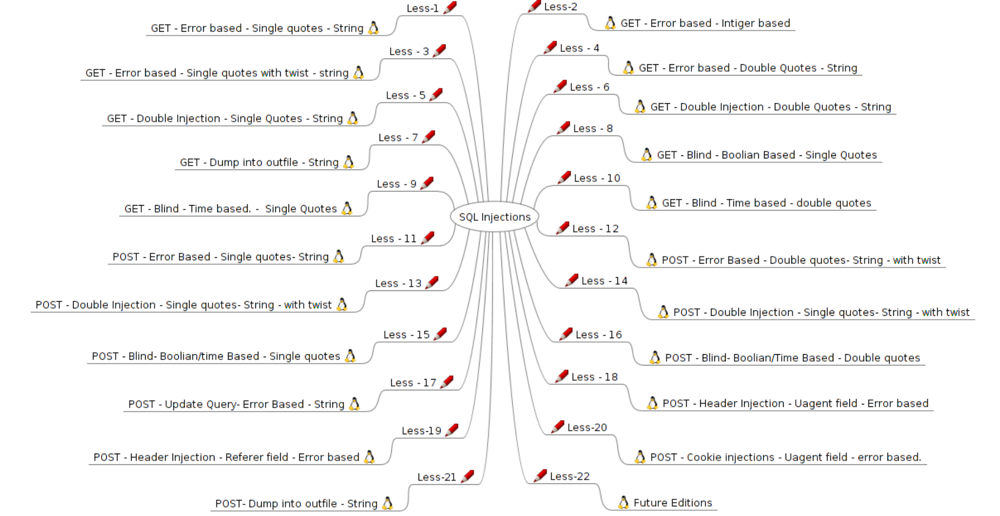

第1关 — 报错注入（Error-based），GET，请求参数用 单引号 闭合（字符串型）

第2关 — 报错注入（Error-based），GET，整数型（Integer-based）

第3关 — 报错注入（Error-based），GET，单引号 闭合，带变体/twist（字符串型）

第4关 — 报错注入（Error-based），GET，双引号 闭合（字符串型）

第5关 — 双重注入（Double Injection），GET，单引号 闭合（字符串型）

第6关 — 双重注入（Double Injection），GET，双引号 闭合（字符串型）

第7关 — 写文件（Dump/INTO OUTFILE），GET，字符串型（写入 webshell 示范 / stacked queries）

第8关 — 盲注 — 布尔盲注（Boolean-based blind），GET，单引号 闭合

第9关 — 盲注 — 时间盲注（Time-based blind），GET，单引号 闭合

第10关 — 盲注 — 时间盲注（Time-based blind），GET，双引号 闭合

第11关 — 报错注入（Error-based），POST，单引号 闭合（字符串型）

第12关 — 报错注入（Error-based），POST，双引号 闭合，带变体/twist（字符串型）

第13关 — 双重注入（Double Injection），POST，单引号 闭合，带变体/twist（字符串型）

第14关 — 双重注入（Double Injection），POST，单引号 闭合（带 twist，字符串型）

第15关 — 盲注（Boolean/Time based 混合），POST，单引号 闭合

第16关 — 盲注（Boolean/Time based 混合），POST，双引号 闭合

第17关 — UPDATE 查询相关的报错注入（Update Query - Error Based），POST，字符串型

第18关 — Header 注入（User-Agent 字段） — 报错注入（Error-based），POST（通过头部注入测试）

第19关 — Header 注入（Referer 字段） — 报错注入（Error-based），POST（通过 Referer 注入）

第20关 — Cookie 注入 / User-Agent 字段 — 报错注入（Error-based），POST（利用 Cookie/UA 注入）

第21关 — 写文件（Dump into outfile），POST，字符串型（通过 POST / 堆叠写文件示例）

第22关 — 未来版 / 扩展（Future Editions，非具体单一注入类型，通常为进阶题目）